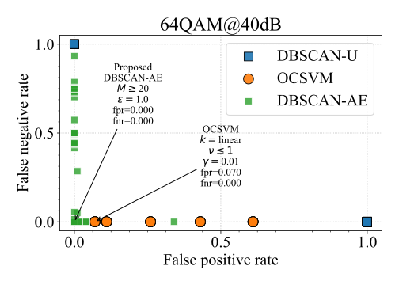

# Spectrum Anomaly Detection for Optical Network Monitoring using Deep Unsupervised Learning

**Authors:** [Carlos Natalino](https://www.chalmers.se/en/staff/Pages/Carlos-Natalino-Da-Silva.aspx)\*, Aleksejs Udalcovs\*\*, Lena Wosinska\*, Oskars Ozolins\*\*, [Marija Furdek](https://www.chalmers.se/en/staff/Pages/Marija-Furdek-Prekratic.aspx)\*

\* Department of Electrical Engineering, Chalmers University of Technology, Gothenburg, Sweden (e-mail: carlos.natalino@chalmers.se, wosinska@chalmers.se, furdek@chalmers.se).

\*\* RISE Research Institutes of Sweden, Kista, Sweden (e-mail: aleksejs.udalcovs@ri.se, oskars.ozolins@ri.se).

**Abstract:** Accurate and efficient anomaly detection is a key enabler for the cognitive management of optical networks, but traditional anomaly detection algorithms are computationally complex and do not scale well with the amount of monitoring data. Therefore, we propose an optical spectrum anomaly detection scheme that exploits computer vision and deep unsupervised learning to perform optical network monitoring relying only on constellation diagrams of received signals. The proposed scheme achieves 100\% detection accuracy even without prior knowledge of the anomalies. Furthermore, operation with encoded images of constellation diagrams reduces the runtime by up to 200 times.

Paper (IEEEXplore): https://ieeexplore.ieee.org/document/9336677
Dataset (IEEE Data Port): https://dx.doi.org/10.21227/g9s9-ba02



# What is in this repository?

To run this implementation, you should download the dataset from IEEE DataPort and point the `base_folder` variable to the location of the dataset.

This repository contains the following files:

- A notebook implementing the training of the autoencoder [here](./training-autoencoder.ipynb)
- A notebook implementing the training (for OCSVM) and performance evaluation for [16QAM@40dB](./testing-accuracy-16QAM_40dB.ipynb), [64QAM@40dB](./testing-accuracy-64QAM_40dB.ipynb) and [16QAM@25dB](./testing-accuracy-16QAM_25dB.ipynb)
- A notebook implementing the runtime performance testing [here](./testing-runtime.ipynb)
- A notebook plotting the results [here](./plots-from-file.ipynb)

## Citing this work:

```
@ARTICLE{NatalinoEtAl:2021:CommLetters,
  author={C. {Natalino} and A. {Udalcovs} and L. {Wosinska} and O. {Ozolins} and M. {Furdek}},
  journal={IEEE Communications Letters}, 
  title={Spectrum Anomaly Detection for Optical Network Monitoring using Deep Unsupervised Learning}, 
  year={2021},
  pages={1-1},
  doi={10.1109/LCOMM.2021.3055064}
}
```

## Dependencies:

This implementation was executed using Python 3.7 and the following libraries:
- TensorFlow 2.x
- Matplotlib
- Scikit-Learn
- ImageIO

